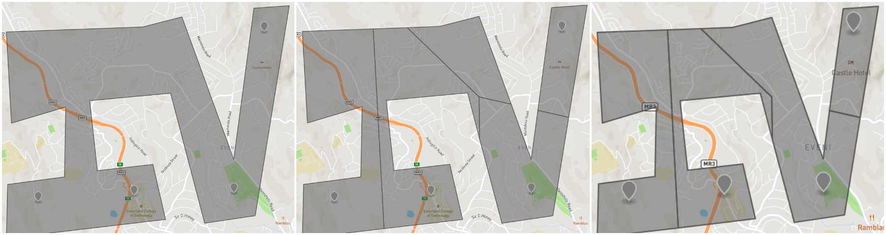

# irregular-voronoi

`irregular-voronoi` makes it dead simple to create voronoi like diagrams constrained to irregular polygons. It ensures that no returned polygon is a MultiPolygon. That each point is in only Polygon. And that all polygons contain a point.



## Usage

```js
const irregularVoronoi = require('irregular-voronoi');

const polygon = { ... };
const points = [ ... ];

const result = irregularVoronoi(polygon, points);
```

- **polygon**: Must be a [GeoJSON Polygon Feature](https://tools.ietf.org/html/rfc7946#section-3.2).
- **points**: Must be an array of [GeoJSON Point Features](https://tools.ietf.org/html/rfc7946#section-3.2).
